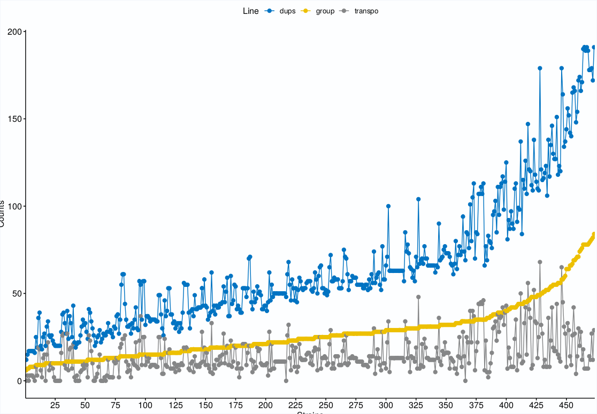
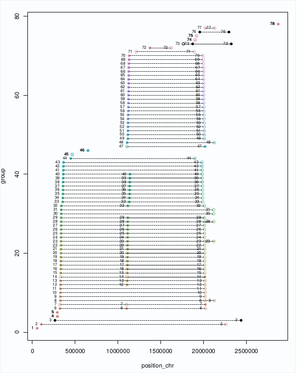
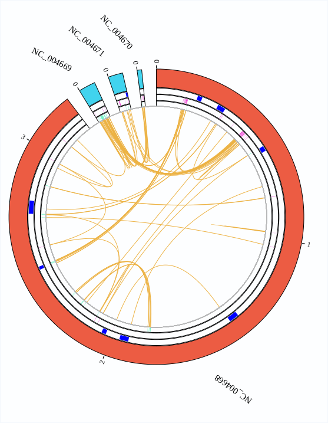

# Duplicates in Gram positive cocci

This is an example workflow and additional details for the bioinformatic analysis generated for the analysis 
of duplicated genes within the genomes of gram positive cocci: *Staphylococcus aureus* and *Enterococcus faecalis*/*faecium*

## Table of Contents

- [Usage](#usage)
  * [Retrieve data](#retrieve-data)
     * [Example](#example)
  * [Gene duplication analysis](#gene-duplication-among-strains-analysis)
     * [Explanation of the workflow](#explanation-of-the-workflow)
     * [Virulence and Resistance Databases retrieval](#virulence-and-resistance-databases-retrieval)
     * [Parameters](#parameters)
     * [Example of use](#example-of-use)
     * [Plot generation](#plot-generation)
  * [Gene duplication between strains analysis](#gene-duplication-between-strains-analysis)
     * [Parameters](#parameters)
     * [Example](#example)
- [Supplementary information](#supplementary-information)
- [Citation](#citation)

## Usage

In order to provide an example of the procedure we followed we have generated an example set in the example folder 
under the `Gram_positive` [folder](https://github.com/molevol-ub/BacterialDuplicates/tree/master/Gram_positive).


> ATTENTION: To replicate the analysis and the example we provide here, we encourage to download the GitHub 
> release corresponding [v2.0](https://github.com/molevol-ub/BacterialDuplicates/releases/tag/v2.0). Some scripts, options 
> and parameters might have changed since that moment and we do not assure 100% resemblance with latest Github release.

Here, we show different steps for the retrieval of the data, analysis and visualization.

### Retrieve data

The data retrieval remains the same in the previous version. Data would be downloaded from NCBI. Necessary data is 
basically translated cds protein for each strain, genomic fasta files and genomic gene feature files (gff). We would also
need genbank files (gbk) for different analysis.

If strains are deposited on GenBank, data can be downloaded using a script we provide here: [NCBI_downloader.pl](https://github.com/molevol-ub/BacterialDuplicates/blob/master/scripts/perl/NCBI_downloader.pl).

```
Usage: 
perl BacterialDuplicates/scripts/NCBI_downloader.pl csv_file option
    csv_file: csv file containing ftp site and name
    option: gff,protein,feature,CDS,genome,ALL
```
Please provide a csv file and option to download data. Use ALL for the download of all information available for each strain specified. 

Please select from https://www.ncbi.nlm.nih.gov/genome your strains of interest and generate a comma separated (csv) 
table containing the ftp site for each strain and the strain name you would like to add. Please do not use any spaces or special characters.

Example data file ([example_strains2download.csv](https://github.com/molevol-ub/BacterialDuplicates/blob/master/Gram_positive/example/example_strains2download.csv)): 
```
## Saureus
ftp://ftp.ncbi.nlm.nih.gov/genomes/all/GCF/000/013/425/GCF_000013425.1_ASM1342v1,GCA_000013425.1_Saureus_NCTC8325

## Efaecalis
ftp://ftp.ncbi.nlm.nih.gov/genomes/all/GCF/000/391/485/GCF_000391485.2_ASM39148v2,GCA_000391485.2_B594

## Efaecium
ftp://ftp.ncbi.nlm.nih.gov/genomes/all/GCF/001/720/945/GCF_001720945.1_ASM172094v1,GCA_001720945.1_ISMMS_VRE_1

## Sepidermidis
ftp://ftp.ncbi.nlm.nih.gov/genomes/all/GCF/006/094/375/GCF_006094375.1_ASM609437v1,GCA_006094375.1_ATCC_14990

## Scarnosus
ftp://ftp.ncbi.nlm.nih.gov/genomes/all/GCF/000/009/405/GCF_000009405.1_ASM940v1,GCA_000009405.1_TM300

## Sxylosus
ftp://ftp.ncbi.nlm.nih.gov/genomes/all/GCF/000/709/415/GCF_000709415.1_ASM70941v1,GCA_000709415.1_SMQ-121
```
We will retrieve all information for each strain but we basically rely on the header information supplied by 
translated_cds.faa file

```
>lcl|FN554766.1_prot_CBG32835.1_1 [gene=thrA] [locus_tag=EC042_0001] [db_xref=GOA:D3H385,InterPro:IPR001048,InterPro:IPR001341,InterPro:IPR001342,InterPro:IPR002912,InterPro:IPR005106,InterPro:IPR011147,InterPro:IPR016040,InterPro:IPR018042,InterPro:IPR019811,InterPro:IPR027795,UniProtKB/TrEMBL:D3H385] [protein=bifunctional aspartokinase I/homoserine dehydrogenase I] [protein_id=CBG32835.1] [location=336..2798] [gbkey=CDS]
MRVLKFGGTSVANAERFLRVADILESNARQGQVATVLSAPAKITNHLVAMIEKTISGQDALPNISDAERIFAELLTGLAA
....
```
> __ATTENTION: DO NOT use file *protein.faa__
> Translated CDS contain directly translated coding sequence regions and sometimes proteins that are identically 
> the same are collapsed into 1 entry into database, so a duplicated gene that has two different positions in the genome, two translated cds would only have one protein.

> **NOTE**: It is possible to generate the same results from a gff file, but it is not implemented neither intended right now.
> Please contact us for further explanation or clarification or to show interest as we might by thinking of implementing this feature. 

#### Example
See additional details and an example of this data retrieval process in the previous [Ecoli analysis example](https://github.com/molevol-ub/BacterialDuplicates/blob/master/Ecoli/Ecoli_genome.md#example)

To replicate the example provided here we did:

```
mkdir data
cd data
perl ../scripts/perl/NCBI_downloader.pl ../Gram_positive/example/example_strains2download.csv ALL
```

This will produce several folders, one for each strain, containing multiple data each folder.

```
jfsanchez@debian:~/BacterialDuplicates$ ls data/
total 204
drwxr-xr-x 2 jfsanchez 464 Aug  6 12:54 GCA_000009405.1_TM300/
drwxr-xr-x 2 jfsanchez 472 Aug  6 12:55 GCA_000013425.1_Saureus_NCTC8325/
drwxr-xr-x 2 jfsanchez 480 Aug  6 12:55 GCA_000391485.2_B594/
drwxr-xr-x 2 jfsanchez 480 Aug  6 12:56 GCA_000709415.1_SMQ-121/
drwxr-xr-x 2 jfsanchez 488 Aug  6 12:56 GCA_001720945.1_ISMMS_VRE_1/
drwxr-xr-x 2 jfsanchez 488 Aug  6 12:55 GCA_006094375.1_ATCC_14990/


jfsanchez@debian:~/BacterialDuplicates$ ls data/GCA_000009405.1_TM300/
total 21652
-rw-r--r-- 1 jfsanchez 2680312 Apr 18 14:36 GCF_000009405.1_ASM940v1_cds_from_genomic.fna
-rw-r--r-- 1 jfsanchez  798976 Apr 18 14:36 GCF_000009405.1_ASM940v1_feature_table.txt
-rw-r--r-- 1 jfsanchez 2598581 Apr  1 13:46 GCF_000009405.1_ASM940v1_genomic.fna
-rw-r--r-- 1 jfsanchez 6324175 Apr 18 14:36 GCF_000009405.1_ASM940v1_genomic.gbff
-rw-r--r-- 1 jfsanchez 1276237 Apr 18 14:36 GCF_000009405.1_ASM940v1_genomic.gff
-rw-r--r-- 1 jfsanchez  890709 Apr 18 14:36 GCF_000009405.1_ASM940v1_protein.faa
-rw-r--r-- 1 jfsanchez   39300 Apr 18 14:36 GCF_000009405.1_ASM940v1_rna_from_genomic.fna
-rw-r--r-- 1 jfsanchez 1190618 Apr 18 14:36 GCF_000009405.1_ASM940v1_translated_cds.faa
```

## Gene duplication among strains analysis

As for the previous analysis in E.coli, we analyzed for each of the samples we retrieved from NCBI the duplicated 
genes within each genome.

During the development of this version, we include several new features and control for putative confounding results. E.g.

- We modified the parsing blast result parameters and set, not only lenght and similarity, 
but also e-values (<1e-05)and bit-score (>50) parameters as default cutoffs.

- We take into account that duplicates might be between any pair of available sequences. 

	* Chrm -> Chrm; 
	* Chrm -> Plasmid; 
	* Plasmid -> Plasmid; 
	* Contig1 -> Contig23214;
	* ...

- We also annotated accordingly pseudogenes to make some statistics later on.

- We additionally cleaned fasta headers that might producing errors due to character encoding.

- We implemented a virulence and resistance search for all proteins and also only among duplicated proteins.

### Explanation of the workflow

Most of these new implementations and corrections were done in script `generate_results_duplicates.pl` and in `parse_BLAST.pl`.

We set the script `duplicate_search_bacteria.pl` to accomodate and generate all results.

```
perl scripts/perl/duplicate_search_bacteria.pl -fasta proteins.fasta -name example 
		-BLAST_path /path/to/BLAST/bin 
		-CARD_db /path/to/CARD_databases/blast_id_name
		-vfdb_db /path/to/VFDB_databases/blast_id_name
		[-CPU nCPU -sim 85 -len 85]

```

This scripts results as the main pipeline of the project, generating up to 15 different steps:

- 1: Make folder

Basically, for each strain a folder is generated containing all results. 

- 2: Clean sequences

Initially, in order to discard possible parsing problems, the script modifies the original 
protein fasta provided and cleans headers (e.g. we change special characters from sequence headers such as "|" that might prevent 
the process to continue). A new clean file is generated **(*_translated_cds.faa_clean.fasta)** that will be used from now on in 
the analysis. We need to take this into account as we might need to recover these proteins later. We use for this step the script `clean_fasta.pl`.

- 3: Makeblastdb
- 4: BLAST proteins
- 5: Parse BLAST

Sequences in **translated_cds.faa_clea.fasta** file are indexed using blast and search discarding autohits. 
We use for this step the script `parse_BLAST.pl`. 

- 6: Generate duplicate results

A similarity and length cutoff of 85% is employed and duplicated genes are reported and grouped accordingly. 
We use for this step the script `generate_results_duplicates.pl`.

- 7: Get fasta seqs results

Duplicated proteins identified are retrieved from the total set using script `get-seq_ids.pl`. 

- 8: BLAST duplicated proteins vs. CARD
- 9: Parse BLAST duplicated CARD results
- 10: BLAST ALL proteins vs. CARD
- 11: Parse BLAST ALL CARD results
- 12: BLAST proteins vs. VFDB
- 13: Parse BLAST VFDB results
- 14: BLAST ALL proteins vs. VFDB
- 15: Parse BLAST ALL VFDB results

Now, only for the duplicated proteins identified and later for all the proteins, virulence and resistance databases 
are searched. The similarity cutoff is automatically relaxed to 35% following homology search strategies ([PMID: 23749753](https://www.ncbi.nlm.nih.gov/pmc/articles/PMC3820096/)).

### Virulence and Resistance Databases retrieval

We downloaded the Virulence Factor Database ([VFDB](http://www.mgc.ac.cn/cgi-bin/VFs/search.cgi)) 
and the Comprehensive Antibiotic Resistance Database ([CARD](https://card.mcmaster.ca/)) databases. 

See additional details on versions downloaded for each database in file `db_info.csv` available in 
the Supplementary information [section](#supplementary-information)

In both cases, we had to rename sequence entries because the header was very long preventing blast parsing results appropiately. 
We did it using the perl script `rename_FASTA_seqs.pl`.

```
perl scripts/perl/rename_FASTA_seqs.pl fasta_file name_file name2add ADD|REPLACE|BEGIN|ADD_BEGIN
```

It basically requires an input fasta file, an output name, a name tag to rename and the one of the following options:

- ADD:Adds the tag name given and a counter, starting at 0, at the end of the header sequence id.
 
- REPLACE: Replaces the whole header sequence id with the tag name given and a counter, starting at 0 

- BEGIN: Splits header sequence id by character '-' and only prints first splitted item.

- ADD_BEGIN: Adds name given and the beginning of the header sequence id

In both cases, we replace the whole header sequence id and replace with a tag and counter. 
We made sure to keep track of the original and the conversion name generated.

#### CARD database

Within CARD database data, we used the information available in file `protein_fasta_protein_homolog_model.fasta`. We renamed
sequences using tag `card` and we indexed the sequences using `makeblastdb`.

```
perl scripts/perl/rename_FASTA_seqs.pl protein_fasta_protein_homolog_model.fasta protein_fasta_protein_homolog_model_renamed.fasta card REPLACE > protein_fasta_protein_homolog_model_renamed.conversion.txt 

makeblastdb -in protein_fasta_protein_homolog_model_renamed.fasta -dbtype prot -input_type fasta -out card_db
```

#### VFDB database

We performed similarly with VFDB data. In this case, we use the information in file `VFDB_setB_pro.fas` and add `VFDB` as a tag.
We also indexed sequences using `makeblastdb`.

```
perl /users/jfsanchez/jfsh_scripts/rename_FASTA_seqs.pl VFDB_setB_pro.fas VFDB_setB_pro.renamed.fas VFDB REPLACE > VFDB_setB_pro.renamed.conversion.txt 

makeblastdb -in VFDB_setB_pro.renamed.fas -dbtype prot -input_type fasta -out VFDB_db
```

### Parameters

#### Mandatory parameters:
- fasta: protein sequences in fasta format translated from CDS E.g. *.translated_cds.faa

- name: name to add to identify files

- BLAST_path: binary path containing blastp and makeblastdb. E.g. /usr/bin/, /software/ncbi-blast/bin, etc.

- CARD_db: Absolute path to the indexed CARD database generated

- vfdb_db: Absolute path to the indexed VFDB database

#### Default parameters [in brakets]:

- CPU: 2

- sim: 85 (% of similarity between any pair of putative duplicated proteins)

- len: 85 (% of minimum length of the query protein fulfilling the similarity cutoff)

### Example of usage

We illustrate the process of duplication analysis by analyzing the example strains provided in file `Gram_positive/example/example_strains2downaload.csv`.
Following previous example guidelines, data must be available in folder `data/`.

Basically, we will call the `duplicate_search_bacteria.pl` for each strain.

```
perl scripts/perl/duplicate_search_bacteria.pl -fasta proteins.fasta -name example 
		-BLAST_path /path/to/BLAST/bin 
		-CARD_db /path/to/CARD_databases/blast_id_name
		-vfdb_db /path/to/VFDB_databases/blast_id_name
		[-CPU nCPU -sim 85 -len 85]

```
To do it for all strains, we create a new folder named `results/` and we  
loop with the contents of `data/` folder. We store commands in file 
`commands_sent.sh` and execute it appropiately according to your system.

```
mkdir results
cd results
for i in `dir ../data/`; 
do 
	file=`readlink -f ../data/$i/*translated_cds.faa`; 
	echo "##############################"; 
	echo "# Processing file: " $file; 
	echo "##############################"; 
	echo "perl ../BacterialDuplicates/scripts/perl/duplicate_search_bacteria.pl \
		-fasta $file -name $i -BLAST_path /soft/ncbi-blast-2.4.0/bin -CPU 2 \ 
		-CARD_db ../databases/CARD/card_db \
		-vfdb_db ../databases/VFDB/VFDB_db."; 
	echo "";  
done > commands_sent.sh
```

> __ATTENTION__: Provide always absolute paths. Here we just provide an example of the command.

For each folder, several results will be produce. See and example here:

```
jfsanchez@debian:~/BacterialDuplicates/results$ ls GCA_000009405.1_TM300/
total 17876
-rw-r--r-- 1 jfsanchez 2535783 Aug  6 19:33 GCA_000009405.1_TM300-BLAST_CARD_all.out
-rw-r--r-- 1 jfsanchez   22481 Aug  6 19:33 GCA_000009405.1_TM300-BLAST_CARD_all.out.BLAST_parsed.txt
-rw-r--r-- 1 jfsanchez    2923 Aug  6 19:32 GCA_000009405.1_TM300-BLAST_CARD_duplicates.out
-rw-r--r-- 1 jfsanchez       0 Aug  6 19:32 GCA_000009405.1_TM300-BLAST_CARD_duplicates.out.BLAST_parsed.txt
-rw-r--r-- 1 jfsanchez       0 Aug  6 19:32 GCA_000009405.1_TM300-BLAST_CARD_duplicates.out.duplicate_relations.txt
-rw-r--r-- 1 jfsanchez 8079682 Aug  6 19:40 GCA_000009405.1_TM300-BLAST_VFDB_all.out
-rw-r--r-- 1 jfsanchez  286001 Aug  6 19:40 GCA_000009405.1_TM300-BLAST_VFDB_all.out.BLAST_parsed.txt
-rw-r--r-- 1 jfsanchez   21201 Aug  6 19:33 GCA_000009405.1_TM300-BLAST_VFDB_duplicates.out
-rw-r--r-- 1 jfsanchez     304 Aug  6 19:33 GCA_000009405.1_TM300-BLAST_VFDB_duplicates.out.BLAST_parsed.txt
-rw-r--r-- 1 jfsanchez      50 Aug  6 19:33 GCA_000009405.1_TM300-BLAST_VFDB_duplicates.out.duplicate_relations.txt
-rw-r--r-- 1 jfsanchez 4393728 Aug  6 19:32 GCA_000009405.1_TM300_BLAST.out
-rw-r--r-- 1 jfsanchez    6184 Aug  6 19:32 GCA_000009405.1_TM300_BLAST.out.allseqs_duplicated.fasta
-rw-r--r-- 1 jfsanchez     526 Aug  6 19:32 GCA_000009405.1_TM300_BLAST.out.allseqs_duplicated.ids.txt
-rw-r--r-- 1 jfsanchez  359151 Aug  6 19:32 GCA_000009405.1_TM300_BLAST.out.annotation_results.csv
-rw-r--r-- 1 jfsanchez     969 Aug  6 19:32 GCA_000009405.1_TM300_BLAST.out.coordinates.csv
-rw-r--r-- 1 jfsanchez    2127 Aug  6 19:32 GCA_000009405.1_TM300_BLAST.out.results.csv
-rw-r--r-- 1 jfsanchez  600717 Aug  6 19:30 GCA_000009405.1_TM300_DB.phr
-rw-r--r-- 1 jfsanchez   19624 Aug  6 19:30 GCA_000009405.1_TM300_DB.pin
-rw-r--r-- 1 jfsanchez  735661 Aug  6 19:30 GCA_000009405.1_TM300_DB.psq
-rw-r--r-- 1 jfsanchez 1190610 Aug  6 19:30 GCA_000009405.1_TM300_clean.fasta
-rw-r--r-- 1 jfsanchez    2030 Aug  6 19:32 GCA_000009405.1_TM300_parsed.txt.BLAST_parsed.txt
-rw-r--r-- 1 jfsanchez     526 Aug  6 19:32 GCA_000009405.1_TM300_parsed.txt.duplicate_relations.txt

```

- Files that end with suffixs \_DB.phr, \_DB.pin and \*_DB.psq correspond to the NCBI BLAST database generated.
- Files that end with \_BLAST.out correspond to the original BLAST result (tabular format)
- Files that contain \_BLAST_parsed.txt contain the filtered BLAST results according to similarity and length thresholds.  
- Files that contain \_BLAST_out.* contain multiple information:
 * \_BLAST.out.results.csv: Contains the duplicated groups and proteins with summarized information. 
 * \_BLAST.out.coordinates.csv: Contains coordinates information for each duplicated gene.
 * \_BLAST.out.annotation_results.csv: Contains additional annotation results extracted from the original data.
 * \_BLAST.out.allseqs_duplicated.ids.txt and \_BLAST.out.allseqs_duplicated.fasta: Contains the ids and fasta sequence, respectively of the duplicated genes identified.
 
- Files containing the tag \_CARD_ correspond to results for the total proteins (\_all) or only the duplicated (\_duplicated) against CARD database.
- Files containing the tag \_VFDB_ correspond to results for the total proteins (\_all) or only the duplicated (\_duplicated) against VFDB database.

To summary all results into a csv file, we execute the following shell command availabe in file `summary_resulsts.sh` `under scripts/bash`.

```
for i in `dir results/`; do 
	groups_array=`wc -l "results/"$i"/"$i"_parsed.txt.duplicate_relations.txt"`; 
	groups=($(echo "$groups_array" | tr '\t' '\n')); 
	dups=`grep -c '>' results/$i/"$i"_BLAST.out.allseqs_duplicated.fasta`; 
	all_seqs=`grep -c '>' results/$i/"$i"_clean.fasta`; 
	transpo=`grep -c 'transposase' "results/"$i"/"$i"_BLAST.out.results.csv"`; 
	hypo=`grep -c 'hypothetical' "results/"$i"/"$i"_BLAST.out.results.csv"`; 
	DUF=`grep -c 'DUF' "results/"$i"/"$i"_BLAST.out.results.csv"`; 
	
	echo $i,$groups,$dups,$all_seqs,$transpo,$hypo,$DUF; 
done
```

In our example here, the results generated will be:

```
GCA_000009405.1_TM300,6,13,2441,0,0,0
GCA_000709415.1_SMQ-121,6,21,2496,8,0,0
GCA_000013425.1_Saureus_NCTC8325,22,48,2767,0,22,0
GCA_001720945.1_ISMMS_VRE_1,122,376,3151,178,90,11
GCA_000391485.2_B594,22,51,3154,15,4,0
GCA_006094375.1_ATCC_14990,12,44,2281,19,13,4
```

Take into account the header we used (strain,groups,dups,all_seqs,transpo,hypo,DUF) where:

- strain: The ID (Genbank ID and strain name)
- groups: The total count of duplicated group genes
- dups: The count of total duplicated genes
- all_seqs: The total amount of proteins for this strain
- transpo: The count of duplicated genes annotated as transposase
- hypo: The count of duplicated genes annotated as hypothetical
- DUF: The count of duplicated genes annotated as Domains of Unknown Function.

<br/><br/>

We will additionaly generate an analysis of putative phages inserted along the genome. We use for
this purpose the python module [PhiSpy](https://github.com/linsalrob/PhiSpy). See additional details
in the original publication.

Again, we loop for the directories in the `data/` folder using as input sequence the GenBank file
retrieved for each strain of interest. 
	
<br/><br/>

### Plot generation

In our analysis, once we had generated a summary csv file for all of the strains of interest, we  
plotted using the R script `exploratory_analysis.R` in folder `scripts/R`.

As an example see the following plot (Figure 1a Sanchez-Herrero et. al 2020) where we show the amount 
of duplicates groups foreach strain and the total number of duplicated genes and duplicated transposases. 




<br/><br/>

Additionally, for each strain of interest, we might generate either circular or lineal representations of the
duplicated genes along the genome. 

- For a linear representation see the example in the previous E.coli analysis [here](https://github.com/molevol-ub/BacterialDuplicates/blob/master/Ecoli/README.md#results-explained-1). 
The script to create this lineal representations is available under the `scripts/R` folder as `Plot_ChromosomeDuplicates.R`. 
It might require small modifications as this script was intended for reference strains used for each of the species analyzed 
in the publication Sanchez-Herrero et. al 2020. The input data for this representatins is the \_BLAST.out.coordinates.csv files. 
See as an example, the linear representation of duplicated genes along the Saureus Newman genome.



<br/><br/>

- For a circular representation of the duplicated genes, including all sequences available (plasmids, contigs) and the annotation of putative phages
along the genome, we created a [BioCircos](https://cran.r-project.org/web/packages/BioCircos/vignettes/BioCircos.html) plot. The script
is available under the `scripts/R` folder as `BioCircos_plotter.R`. The input information is again the \_BLAST.out.coordinates.csv file, the
coordinates of annotated phages and the length and names of the different sequences in the genome. See as an example, the
circular representation of the E. faecalis V583 (Figure 6 Sanchez-Herrero et. al 2020)




<br/><br/>
	
## Gene duplication between strains analysis

For each species we analyzed here, Staphylococcus aures, Enterococcus faecalis and E. faecium, we selected some interesting
strains and create an analysis of shared duplicated genes with other strains of the same species.

See additional details and an example in the previous E. coli analysis [here](https://github.com/molevol-ub/BacterialDuplicates/blob/master/Ecoli/README.md#gene-duplication-between-strains-analysis)


## Supplementary information

Folder `Gram_positive/data` contains supplementary information related to the publication.

Strains analyzed in the corresponding analysis and paper are deposited in files `strains/*samples.csv`.
See additional details [here](https://github.com/molevol-ub/BacterialDuplicates/blob/master/Gram_positive/data/strains)

Results to replicate the analysis and plotted included in the publication that was generated are deposited under folder `results/`

## Citation

Gene Duplications in the Genomes of Staphylococci and Enterococci. Sanchez-Herrero JF., Bernabeu M., Prieto A., Hüttener M. and Juárez A. **Front. Mol. Biosci.** *2020 7:160*. https://doi.org/10.3389/fmolb.2020.00160
