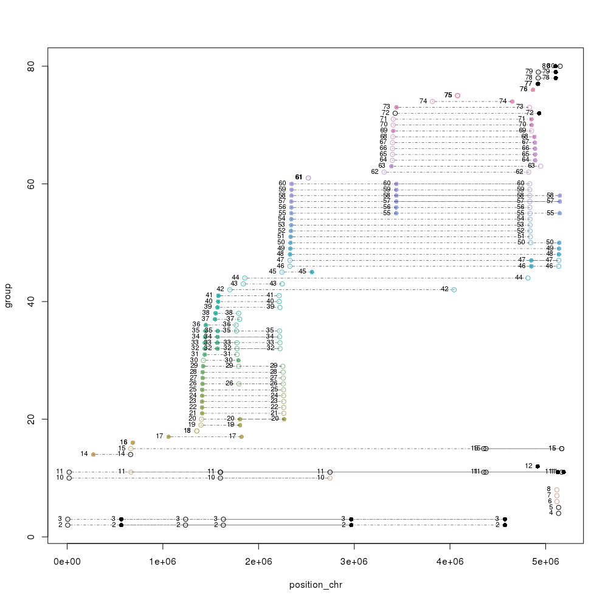

# BacterialDuplicates git repository

## Description

This scripts and data collected in this repo correspond to the analysis performed to identify bacterial duplicated genes that led to the following paper. 

https://bmcgenomics.biomedcentral.com/articles/10.1186/s12864-019-5683-4

## Citation

Gene duplications in the E. coli genome: common themes among pathotypes. Manuel Bernabeu, José Francisco Sánchez-Herrero, Pol Huedo, Alejandro Prieto, Mário Hüttener, Julio Rozas and Antonio Juárez. BMC Genomics 2019 20:313, https://doi.org/10.1186/s12864-019-5683-4


## Usage

In order to provide an example of the procedure we followed we have generated an example set in the example folder.

#### 1) Retrieve data

Data can be downloaded from NCBI or could be provided by the user. Necessary data is basically protein annotated genes, gff file and genome fasta file for each strain. 

If strains are deposited on GenBank, data can be downloaded using a script we provide here: [NCBI_downloader.pl](https://github.com/molevol-ub/BacterialDuplicates/blob/master/scripts/NCBI_downloader.pl).

```
Usage: 
perl BacterialDuplicates/scripts/NCBI_downloader.pl csv_file option
    csv_file: csv file containing ftp site and name
    option: gff,protein,feature,CDS,genome,ALL
```
Please provide a csv file and option to download data. Use ALL for the download of all information available for each strain specified. 

Please select from https://www.ncbi.nlm.nih.gov/genome your strains of interest and generate a comma separated (csv) table containing the ftp site for each strain and the strain name you would like to add. Please do not use any spaces or special characters.

Example data file ([example_strains2download.csv](https://github.com/molevol-ub/BacterialDuplicates/blob/master/example/example_strains2download.csv)): 

```
## Commensal
ftp://ftp.ncbi.nlm.nih.gov/genomes/all/GCF/000/482/265/GCF_000482265.1_EC_K12_MG1655_Broad_SNP,GCF_000482265.1_K-12_MG1655
## EAEC
ftp://ftp.ncbi.nlm.nih.gov/genomes/all/GCA/000/027/125/GCA_000027125.1_ASM2712v1,GCA_000027125.1_Ecoli042
```

##### Example

To reproduce the example provided here:

```
perl BacterialDuplicates/scripts/NCBI_downloader.pl BacterialDuplicates/example/strains2download.csv ALL
```

Two folders should be generated named as the strain provided containing several files: GFF, protein and nucleotide sequences of the protein-coding genes, genomic sequence and other information.

```
$ ls test_BacterialDuplicates/
drwxr-xr-x 2 jsanchez 4096 May 20 14:15 GCA_000027125.1_Ecoli042/
drwxr-xr-x 2 jsanchez 4096 May 20 14:16 GCF_000482265.1_K-12_MG1655/

$ ls test_BacterialDuplicates/*
GCA_000027125.1_Ecoli042:
total 23256
-rw-r--r-- 1 jsanchez 6161284 May 13  2017 GCA_000027125.1_ASM2712v1_cds_from_genomic.fna
-rw-r--r-- 1 jsanchez 1427154 Dec 16  2017 GCA_000027125.1_ASM2712v1_feature_table.txt
-rw-r--r-- 1 jsanchez 5422377 May 18  2016 GCA_000027125.1_ASM2712v1_genomic.fna
-rw-r--r-- 1 jsanchez 5870497 Dec 16  2017 GCA_000027125.1_ASM2712v1_genomic.gff
-rw-r--r-- 1 jsanchez 1898693 May 18  2016 GCA_000027125.1_ASM2712v1_protein.faa
-rw-r--r-- 1 jsanchez   50018 May 13  2017 GCA_000027125.1_ASM2712v1_rna_from_genomic.fna
-rw-r--r-- 1 jsanchez 2966382 Dec 16  2017 GCA_000027125.1_ASM2712v1_translated_cds.faa

GCF_000482265.1_K-12_MG1655:
total 17224
-rw-r--r-- 1 jsanchez 5083154 Dec 13  2017 GCF_000482265.1_EC_K12_MG1655_Broad_SNP_cds_from_genomic.fna
-rw-r--r-- 1 jsanchez 1564488 Dec 13  2017 GCF_000482265.1_EC_K12_MG1655_Broad_SNP_feature_table.txt
-rw-r--r-- 1 jsanchez 4697019 Nov  1  2014 GCF_000482265.1_EC_K12_MG1655_Broad_SNP_genomic.fna
-rw-r--r-- 1 jsanchez 2224109 Dec 13  2017 GCF_000482265.1_EC_K12_MG1655_Broad_SNP_genomic.gff
-rw-r--r-- 1 jsanchez 1712788 Dec 13  2017 GCF_000482265.1_EC_K12_MG1655_Broad_SNP_protein.faa
-rw-r--r-- 1 jsanchez   58451 May  5  2017 GCF_000482265.1_EC_K12_MG1655_Broad_SNP_rna_from_genomic.fna
-rw-r--r-- 1 jsanchez 2281872 Dec 13  2017 GCF_000482265.1_EC_K12_MG1655_Broad_SNP_translated_cds.faa

```

#### 2) Gene duplication among strains analysis

The script [duplicate_search_bacteria.pl](https://github.com/molevol-ub/BacterialDuplicates/blob/master/scripts/duplicate_search_bacteria.pl) generates a blast database of the provide protein fasta and searches for putative duplicates.

```
Usage:
perl BacterialDuplicates/scripts/duplicate_search_bacteria.pl 
    -fasta proteins.fasta 
    -script_path /path/to/script/parse_BLAST.pl 
    -name example 
    -BLAST_path /path/to/BLAST/bin 
    [-n CPUs -sim 85 -len 85]
```

##### Mandatory parameters:
fasta: protein sequences in fasta format translated from CDS E.g. *.translated_cds.faa

name: name to add to identify files

BLAST_path: binary path containing blastp and makeblastdb. E.g. /usr/bin/, /software/ncbi-blast/bin, etc.

script_path: path for [parse_BLAST.pl](https://github.com/molevol-ub/BacterialDuplicates/blob/master/scripts/parse_BLAST.pl)

```
ATTENTION: DO NOT use file *protein.faa
   
Translated CDS contain directly translated coding sequence regions and sometimes proteins that are identically the same are collapsed into 1 entry into database, so a duplicated gene that has two different positions in the genome, two translated cds would only have one protein.
```

##### Default parameters [in brakets]:
CPU: 2

sim: 85 (% of similarity between any pair of putative duplicated proteins)

len: 85 (% of minimum length of the query protein fulfilling the similarity cutoff)

##### Explanation of the workflow
In order to discard possible parsing problems, the script modifies the original protein fasta provided and cleanes it.

We discard pseudogenes sequences (marked as pseudo=true in the header) and we change special characters from sequence headers such as "|" that might prevent the process to continue. 

A new clean file is generated (*_translated_cds.faa_clean.fasta) that will be used from now on in the analysis. We need to take this into account as we might need to recover these proteins later.
 

##### Example of use

To reproduce the example provided here:
```
perl BacterialDuplicates/scripts/duplicate_search_bacteria.pl -fasta test_BacterialDuplicates/GCA_000027125.1_Ecoli042/GCA_000027125.1_ASM2712v1_translated_cds.faa -name GCA_000027125.1_Ecoli042_results -BLAST_path /software/ncbi-blast/bin -script_path BacterialDuplicates/scripts/parse_BLAST.pl

perl BacterialDuplicates/scripts/duplicate_search_bacteria.pl -fasta test_BacterialDuplicates/GCF_000482265.1_K-12_MG1655/GCF_000482265.1_EC_K12_MG1655_Broad_SNP_translated_cds.faa -name GCF_000482265.1_K-12_MG1655_results -BLAST_path /software/ncbi-blast/bin -script_path BacterialDuplicates/scripts/parse_BLAST.pl
```

Please provide absolute path for files and folders and remember that names can not contain spaces or special characters.

##### Results explained.
For the example here we obtained the following data.

```
$ ls *results
GCA_000027125.1_Ecoli042_results:
total 11860
-rw-r--r-- 1 jsanchez 8772786 May 20 14:23 GCA_000027125.1_Ecoli042_results_BLAST.out
-rw-r--r-- 1 jsanchez 1661449 May 20 14:20 GCA_000027125.1_Ecoli042_results_DB.phr
-rw-r--r-- 1 jsanchez   39568 May 20 14:20 GCA_000027125.1_Ecoli042_results_DB.pin
-rw-r--r-- 1 jsanchez 1540505 May 20 14:20 GCA_000027125.1_Ecoli042_results_DB.psq
-rw-r--r-- 1 jsanchez   62062 May 20 14:23 GCA_000027125.1_Ecoli042_results_parsed.txt.BLAST_parsed.txt
-rw-r--r-- 1 jsanchez   13470 May 20 14:23 GCA_000027125.1_Ecoli042_results_parsed.txt.coordinates.csv
-rw-r--r-- 1 jsanchez   38910 May 20 14:23 GCA_000027125.1_Ecoli042_results_parsed.txt.results.csv

GCF_000482265.1_K-12_MG1655_results:
total 11712
-rw-r--r-- 1 jsanchez 9415392 May 20 15:54 GCF_000482265.1_K-12_MG1655_results_BLAST.out
-rw-r--r-- 1 jsanchez 1135462 May 20 15:52 GCF_000482265.1_K-12_MG1655_results_DB.phr
-rw-r--r-- 1 jsanchez   35984 May 20 15:52 GCF_000482265.1_K-12_MG1655_results_DB.pin
-rw-r--r-- 1 jsanchez 1353706 May 20 15:52 GCF_000482265.1_K-12_MG1655_results_DB.psq
-rw-r--r-- 1 jsanchez   23830 May 20 15:54 GCF_000482265.1_K-12_MG1655_results_parsed.txt.BLAST_parsed.txt
-rw-r--r-- 1 jsanchez    4303 May 20 15:54 GCF_000482265.1_K-12_MG1655_results_parsed.txt.coordinates.csv
-rw-r--r-- 1 jsanchez    8695 May 20 15:54 GCF_000482265.1_K-12_MG1655_results_parsed.txt.results.csv

```

- Files that end with suffixs *_DB.phr, *_DB.pin and *_DB.psq correspond to the NCBI BLAST database generated.
- Files that endswith *BLAST.out correspond to the original BLAST result (tabular format) and *BLAST_parsed.txt the information filtered according to user input similarity and length thresholds.
- File *coordinates.csv contains the information of the coordinates of the different groups obtained.
- File *results.csv summarizes all results and contains all the relevant information for the interpretation of results.

##### Generate plot
Use the coordinates file generated to obtain the plot using the R script: [Plot_ChromoseDuplicates.R](https://github.com/molevol-ub/BacterialDuplicates/blob/master/scripts/Plot_ChromoseDuplicates.R)

Edit the script for each strain desired and add the coordinate full path to the line 4:

```
bed_info <- read.table("coordinates.csv",sep=",",header=FALSE)
```
##### Results explained.
This image is an example plot generated for the example provided here (GCA_000027125.1_Ecoli042) [Click image to see details].



Plot of the duplicated genes along the chromosome:
- The "X" axis corresponds to the linear map of the chromosome. 
- Numbers on the "Y" axis correspond to the different duplicated genes, which have been numbered by their order starting from the origin of the chromosomal map. 
- Each group of spots connected by a horizontal dashed line corresponds to a single gene duplicated in different positions on the chromosome. 
- Different spots indicate the map positions of the different copies of the gene. 
- Point shapes represent the strand on which a protein is encoded: filled circle for (+) strand and circle for (−) strand.
- Black closed and open circles correspond to transposases. 
- Some groups are not shown because because they map to a plasmid (if present) (not shown in the figure).


#### 3) Gene duplication between strains analysis

Once you have identified a set of putative duplicated proteins in your strain of interest, you might want to know if these are also duplicated in other strains. Also you might have a set of proteins and you may just want to have a quick view of the duplication among any other strains.

For the analysis of putative duplicated proteins between strains, we use the script [protein_Search_genome.pl](https://github.com/molevol-ub/BacterialDuplicates/blob/master/scripts/protein_Search_genome.pl):

```
Usage:
	perl BacterialDuplicates/scripts/protein_Search_genome.pl 
	-proteins proteins.fasta 
	-name example 
	-BLAST_path /path/to/BLAST/bin/
	-strain /mydirectory/DATA/ecoli/strain_BL21_proteins.faa,BL21 [ -strain /mydirectory/DATA/ecoli/strain_042_proteins.faa,Ecoli042 ] 
	[-CPU nCPUs -sim 85 -len 85]
```
This script generates a blast database for each strain provided and search the given proteins.

Please provide absolute path for files and folders and remember that names can not contain spaces or special characters.

##### Mandatory parameters:
proteins: proteins of interest in fasta format

name: name to add to identify files

BLAST_path: binary path containing blastp and makeblastdb. E.g. /usr/bin/, /software/ncbi-blast/bin, etc.

strain: Protein fasta file and id for each strain of interest to compare. Several strains can be provided. 

	Provide a comma separated value with path to protein file and id for the strain.

	Example: -strain /mydirectory/DATA/ecoli/strain_BL21_translated_cds.faa,BL21 -strain /mydirectory/DATA/ecoli/strain_042_translated_cds.faa,Ecoli042

```
ATTENTION: DO NOT use file *protein.faa
   
Translated CDS contain directly translated coding sequence regions and sometimes proteins that are identically the same are collapsed into 1 entry into database, so a duplicated gene that has two different positions in the genome, two translated cds would only have one protein.
```

##### Default parameters [in brakets]:
CPU: 2

sim: 85 (% of similarity between any pair of putative duplicated proteins)

len: 85 (% of minimum length of the query protein fulfilling the similarity cutoff)

##### Example

To reproduce the example provided here, we performed a previous step to retrieve the proteins.

We initially identified (in step 2) putative duplicated proteins in our strains and we need to obtain the protein fasta sequence of these proteins as an input for the analysis of duplication between strains. Two possible options appear here:

1. You can manually copy and paste sequences into a new file

2. You can employ a script to automatically perform this task. To do so, we will employ the script add it here named:(get-seq_ids.pl)[] 

```
Usage:
perl BacterialDuplicates/scripts/get-seq_ids.pl ids.txt sequences.fasta output_file.fasta

```
Basically, this script takes as a first argument a group of ids in a txt file (one per line), a sequence fasta file and the name for the output fasta file generated.

Following the example here, we will retrieved all the duplicated genes from our results.csv file generated in Step 2 for Ecoli 042. Again, you can manually retrieve them or employ an automatic solution.

```
awk -F "," '{print $2}' GCA_000027125.1_Ecoli042_results/GCA_000027125.1_Ecoli042_results_parsed.txt.results.csv | grep -v 'ID-1' | grep -v "^$" > ids.txt
```

Now, we will retrieve these ids from the clean file previously generated (*_translated_cds.faa_clean.fasta).

```
perl BacterialDuplicates/scripts/get-seq_ids.pl ids.txt GCA_000027125.1_Ecoli042/GCA_000027125.1_ASM2712v1_translated_cds.faa_clean.fasta duplicated_proteins_Ecoli042.fasta
```

duplicated_proteins_Ecoli042.fasta will contain the fasta sequences of the duplicated proteins (one per group of duplicates).

Once you have the set of interest proteins, the strains of interest selected, we would generate the analysis of duplicated proteins between strains.

To reproduce the example provided here, we did:

```
perl BacterialDuplicates/scripts/protein_Search_genome.pl -proteins duplicated_proteins_Ecoli042.fasta -BLAST_path /soft/bin/ -strain GCA_000027125.1_Ecoli042/GCA_000027125.1_ASM2712v1_translated_cds.faa_clean.fasta,Ecoli042 -strain GCF_000482265.1_K-12_MG1655/GCF_000482265.1_EC_K12_MG1655_Broad_SNP_translated_cds.faa_clean.fasta,Ecoli_K12 -name example_analysis
```
Please provide absolute path for files and folders and remember that names can not contain spaces or special characters.

##### Results explained

For the example here we obtained the following data.

```
$ ls example_analysis
total 5924
-rw-r--r-- 1 jsanchez 1661449 May 21 11:45 Ecoli042_DB.phr
-rw-r--r-- 1 jsanchez   39568 May 21 11:45 Ecoli042_DB.pin
-rw-r--r-- 1 jsanchez 1540505 May 21 11:45 Ecoli042_DB.psq
-rw-r--r-- 1 jsanchez  132807 May 21 11:45 Ecoli042_DB_BLAST.out
-rw-r--r-- 1 jsanchez   16178 May 21 11:45 Ecoli042_DB_BLAST.out_parsed.txt
-rw-r--r-- 1 jsanchez 1135462 May 21 11:45 Ecoli_K12_DB.phr
-rw-r--r-- 1 jsanchez   35984 May 21 11:45 Ecoli_K12_DB.pin
-rw-r--r-- 1 jsanchez 1353706 May 21 11:45 Ecoli_K12_DB.psq
-rw-r--r-- 1 jsanchez  109284 May 21 11:45 Ecoli_K12_DB_BLAST.out
-rw-r--r-- 1 jsanchez    4878 May 21 11:45 Ecoli_K12_DB_BLAST.out_parsed.txt
-rw-r--r-- 1 jsanchez   11195 May 21 11:45 relations_proteins.csv
-rw-r--r-- 1 jsanchez    3213 May 21 11:45 table.csv
```


